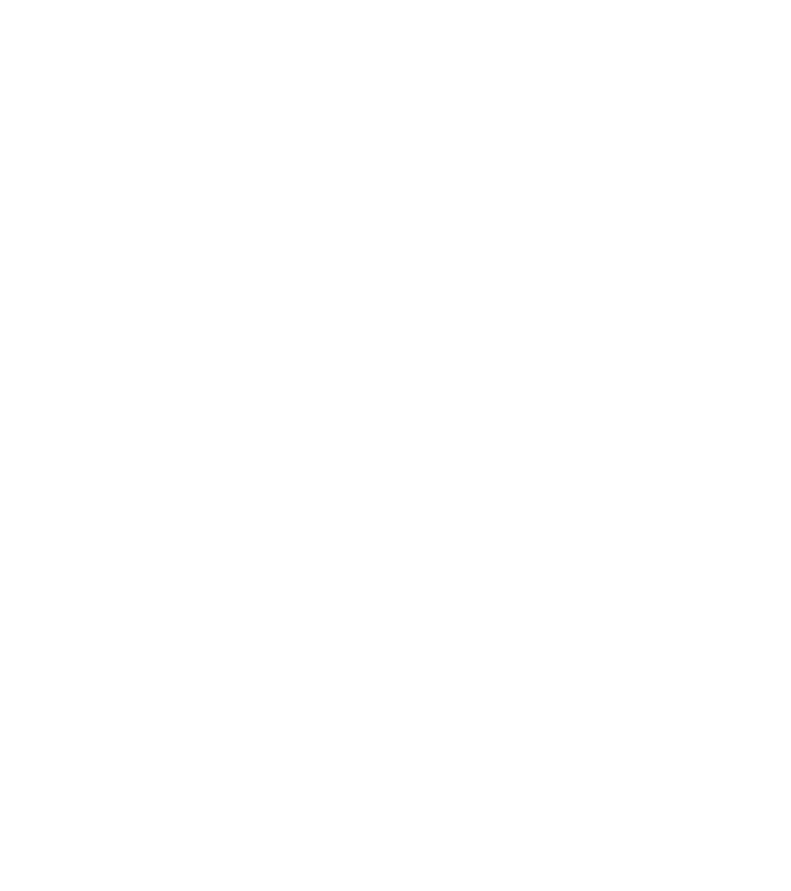

<p align="center">
  
</p>
<p align="center">
    <h1 align="center">TUSHAR-KHANAGWAL-PORTFOLIO</h1>
</p>
<p align="center">
    <em>Welcome to my portfolio website repository  🚀</em>
	<a href="https://tusharkhanagwal.me">Live</a>
    ·
    <a href="https://github.com/Tusharknwl/Tushar-Khanagwal-Portfolio/issues">Report Bug</a>
</p>
<p align="center">
	
	
	
<p>
<p align="center">
		<em>Developed with the software and tools below.</em>
</p>
<p align="center">
	
	
	
	
	
    
    
  
    

</p>
<hr>

## Quick Links

> - [ Overview](#-overview)
> - [ Features](#-features)
> - [ Repository Structure](#-repository-structure)
> - [ Getting Started](#-getting-started)
>   - [ Installation](#-installation)
>   - [ Running Tushar-Khanagwal-Portfolio](#-running-Tushar-Khanagwal-Portfolio)
> - [ Contributing](#-contributing)
> - [ License](#-license)

---

## Overview

This website provides insights into my educational background, professional experience, projects, and technical skills. It's designed to be responsive and user-friendly, ensuring a seamless browsing experience.

---

## Features

- **Responsive Design**: Optimized for various screen sizes.
- **Interactive Elements**: Engaging animations and transitions.
- **3D Model**: Interactive 3D models using Three.js.
- **Project Showcase**: Details about projects I've worked on.
- **Skill Showcase**: Highlights my technical skills.
- **Experience Section**: Provides an overview of my professional experience.
- **Contact Form**: Allows visitors to reach out to me directly.

---

## Repository Structure

```sh
└── Tushar-Khanagwal-Portfolio/
    ├── index.html
    ├── package-lock.json
    ├── package.json
    ├── postcss.config.js
    ├── public
    │   └── planet
    ├── redme.md
    ├── src
    │   ├── App.jsx
    │   ├── assets
    │   ├── components
    │   │   ├── About.jsx
    │   │   ├── Contact.jsx
    │   │   ├── Experience.jsx
    │   │   ├── Footer.jsx
    │   │   ├── Hero.jsx
    │   │   ├── Loader.jsx
    │   │   ├── Navbar.jsx
    │   │   ├── Technologies.jsx
    │   │   ├── Works.jsx
    │   │   ├── canvas
    │   │   │   ├── Earth.jsx
    │   │   │   ├── Model.jsx
    │   │   │   ├── Stars.jsx
    │   │   │   └── index.js
    │   │   └── index.js
    │   ├── constants
    │   │   └── index.js
    │   ├── hoc
    │   │   ├── SectionWrapper.jsx
    │   │   └── index.js
    │   ├── index.css
    │   ├── main.jsx
    │   ├── styles.js
    │   └── utils
    │       └── motion.js
    ├── tailwind.config.js
    └── vite.config.js
```

---

## Getting Started

### Installation

1. Clone the Tushar-Khanagwal-Portfolio repository:

```sh
git clone https://github.com/Tusharknwl/Tushar-Khanagwal-Portfolio
```

2. Change to the project directory:

```sh
cd Tushar-Khanagwal-Portfolio
```

3. Install the dependencies:

```sh
npm install
```

### .evn file structure

```sh
VITE_APP_EMAILJS_SERVICE_ID=<user email js service id>
VITE_APP_EMAILJS_TEMPLATE_ID=<user email js template id>
VITE_APP_EMAILJS_PUBLIC_KEY=<user email js public key>
VITE_APP_SPLINE_MODEL_URL=<spline model url>
```

### Running Tushar-Khanagwal-Portfolio

Use the following command to run Tushar-Khanagwal-Portfolio:

```sh
node run dev
```

## Contributing

Contributions are welcome! Here are several ways you can contribute:

- **[Submit Pull Requests](https://github.com/Tusharknwl/Tushar-Khanagwal-Portfolio/blob/main/CONTRIBUTING.md)**: Review open PRs, and submit your own PRs.
- **[Join the Discussions](https://github.com/Tusharknwl/Tushar-Khanagwal-Portfolio/discussions)**: Share your insights, provide feedback, or ask questions.
- **[Report Issues](https://github.com/Tusharknwl/Tushar-Khanagwal-Portfolio/issues)**: Submit bugs found or log feature requests for Tushar-khanagwal-portfolio.

<details closed>
    <summary>Contributing Guidelines</summary>

1. **Fork the Repository**: Start by forking the project repository to your GitHub account.
2. **Clone Locally**: Clone the forked repository to your local machine using a Git client.
   ```sh
   git clone https://github.com/Tusharknwl/Tushar-Khanagwal-Portfolio
   ```
3. **Create a New Branch**: Always work on a new branch, giving it a descriptive name.
   ```sh
   git checkout -b new-feature-x
   ```
4. **Make Your Changes**: Develop and test your changes locally.
5. **Commit Your Changes**: Commit with a clear message describing your updates.
   ```sh
   git commit -m 'Implemented new feature x.'
   ```
6. **Push to GitHub**: Push the changes to your forked repository.
   ```sh
   git push origin new-feature-x
   ```
7. **Submit a Pull Request**: Create a PR against the original project repository. Clearly describe the changes and their motivations.

Once your PR is reviewed and approved, it will be merged into the main branch.

</details>

---

## License

This project is protected under the MIT License. For more details, refer to the [LICENSE]() file.
